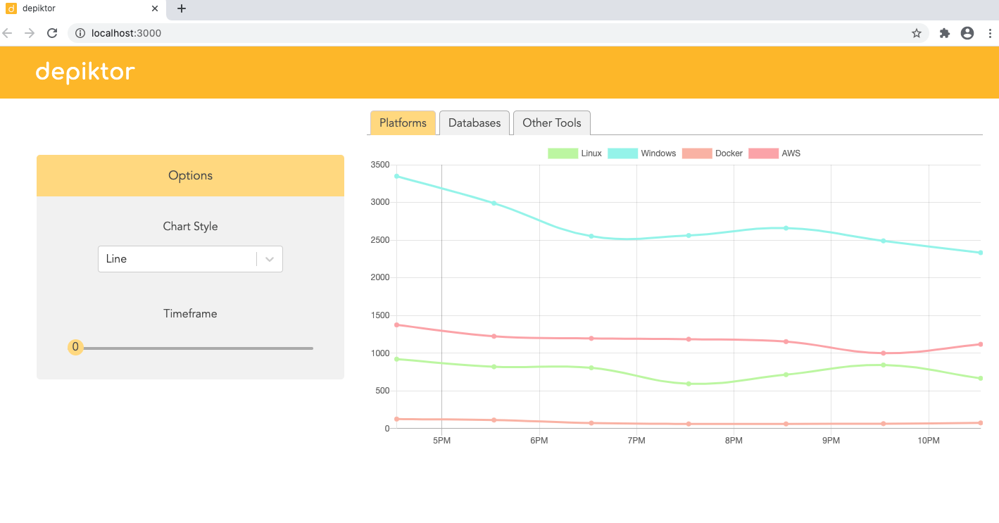

# depiktor

depiktor is a full-stack SPA, which keeps you on top of technology trends via the Twitter API. Using the technologies listed in the 2020 StackOverflow Developer Survey, Depiktor queries Twitter for the number of mentions of those technologies every hour and saves the count to display it interactively.

  

You can find the live version [here](https://depiktor.herokuapp.com).

## Tech Stack

### Front End

- ChartJS
- React
- CSS

### Back End

- Express
- Sequelize
- PostgreSQL
- NodeJS

### Testing

- Jest
- Supertest
- Jasmine
- Mocha

## Requirements

- Twitter Developer Account
- Registered Twitter app
- Node, npm, and PostgreSQL

## Installation

- Download a copy of the repository on your machine.
- In your running PostgreSQL instance:
- Create a DB with the name `depiktor_dev`
- Seed the DB by running `node create_technologies.js`
- Run `npm install` in the client and server folders.

## Configuration

- Create a `.env` file in the server folder like this:

`TWITTER_CONSUMER_KEY=YOUR_TWITTER_CONSUMER_KEY`

`TWITTER_CONSUMER_SECRET=YOUR_TWITTER_CONSUMER_SECRET`

`PG_DATABASE_USER=YOUR_PG_DATABASE_USER`

## Usage

#### Collect your own data

- Run `node background_worker.js`, the DB will be populated with data every hour.

#### Use with mock data

- Navigate to `client/src/services/ApiClient.jsx`.
- Follow the instructions to load mock data.

### Run app

- In the server folder run `node start`.
- In the client/src folder run `npm start`.
- View the results in the browser. :chart_with_upwards_trend:

## Testing

- In the client folder run `npm test`, tests will be updated as you save files
- In the server folder run `npm test`, tests will be updated as you save files

## Roadmap

- Have two background workers populating one half of the DB to avoid going over the Twitter API limit.
- Refactor `controller.js` into a `controller.js` and a `view.js` to separate concerns.
- User can create a new tab and input their own search terms.
- User view their custom search terms when logged into their profile.
- Add a test suite.
- Mobile friendly.
- Make available offline via PWA.
- Train an NLP model to detect technologies in their correct context. Discard mentions of, for example, 'Angular' when they are not in the context of the Angular framework.

## Contributing

Pull requests are welcome. For major changes, please open an issue first to discuss what you would like to change.

## Developers

- Nils Wernecke - [GitHub](https://github.com/locomocoroco) - [LinkedIn](https://www.linkedin.com/in/niwern/)
- Juan Carrillo - [GitHub](https://github.com/juanpc10) - [LinkedIn](https://www.linkedin.com/in/juanpc10/)
- Lena - [GitHub](https://github.com/LenaDeor)

## License

[MIT](https://choosealicense.com/licenses/mit/)
